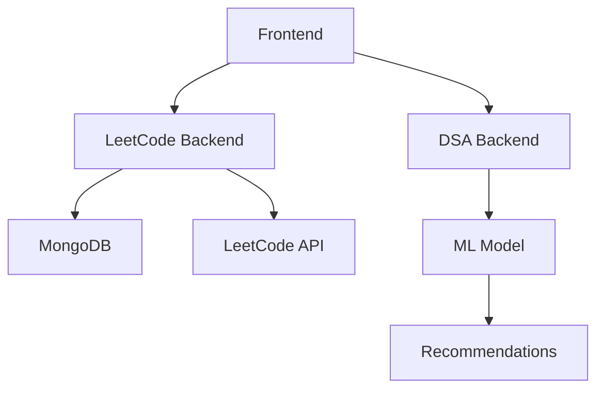

# 🚀 DSA-Recommender Platform

An AI-powered DSA (Data Structures & Algorithms) learning platform that provides personalized LeetCode problem recommendations using machine learning.


## ✅ Features (Phase 1 Complete)

### 🔐 **Authentication System**

- JWT-based authentication with bcrypt password hashing
- Secure httpOnly cookies for session management
- Protected routes across entire application
- Session persistence and automatic logout

### 🤖 **AI-Powered Recommendations**

- Personalized problem suggestions using SentenceTransformers
- Semantic similarity matching with all-MiniLM-L6-v2 model
- Context-aware recommendations based on solved problems and preferences
- Real-time refresh for new suggestions

### 📊 **Real-Time Analytics**

- Topic-wise performance tracking across 12 DSA topics
- Difficulty distribution (Easy/Medium/Hard)
- Streak calculation and progress monitoring
- Comprehensive user reports with star ratings

### 👤 **User Profiles**

- Activity calendar heatmap (GitHub-style)
- Progress charts and visualizations
- LeetCode integration settings
- Customizable preferences and goals

### 🎓 **Personalized Learning**

- Experience level tracking (Beginner/Intermediate/Advanced/Expert)
- Preparation goal setting (Internship/Placement/Competitive/Skill-building)
- Daily practice targets (2-10 problems/day)
- Confident topics selection for better recommendations

### 📚 **Problem Management**

- Browse by 12 DSA topics (Arrays, Strings, Trees, Graphs, DP, etc.)
- Filter by difficulty and solved/unsolved status
- Search functionality across problem titles and tags
- Direct LeetCode integration with one-click solve
- Real-time solved/unsolved tracking

### 🎨 **Modern UI/UX**

- Dark/light theme toggle with smooth transitions
- Responsive design for all screen sizes
- Loading states and error handling
- Smooth animations and transitions

## 🏗️ **Architecture**

### **Frontend** (Next.js 15 + Tailwind CSS 4)

- **Pages**:
  - `dashboard.js` - Main dashboard with AI recommendations
  - `report.js` - Topic-wise analysis and ratings
  - `profile.js` - User profile with charts and settings
  - `topic/[topic].js` - Dynamic topic-specific problem lists
  - `past-records.js` - Historical performance data
  - `personalize.js` - User preference setup

### **LeetCode Backend** (Node.js + Express + MongoDB)

- **Enhanced APIs**:
  - `/api/profile/:username` - User profile data
  - `/api/report/:username` - Topic-wise analytics
  - `/api/topic/:topic/problems` - Topic-specific problems
  - `/api/preferences/:username` - User preferences management
  - `/api/progress/:username` - Progress charts data
  - `/api/acceptedQuestion/:username` - LeetCode sync

### **DSA Backend** (Python + FastAPI)

- **ML Recommendation Engine**: Uses SentenceTransformers
- **Semantic Similarity**: Advanced problem matching
- **Personalized Suggestions**: Based on solved problems

## 📈 **Topic Coverage**

The platform now covers **12 core DSA topics** with intelligent analysis:

| Topic               | Icon | Coverage                      |
| ------------------- | ---- | ----------------------------- |
| Arrays              | 📊   | Two Pointers, Sliding Window  |
| Strings             | 🔤   | String Matching, Manipulation |
| Linked Lists        | 🔗   | Singly, Doubly, Circular      |
| Trees               | 🌳   | Binary Trees, BST, AVL        |
| Graphs              | 🕸️   | BFS, DFS, Union Find          |
| Dynamic Programming | ⚡   | Memoization, Tabulation       |
| Sorting             | 📈   | All major algorithms          |
| Searching           | 🔍   | Binary Search variants        |
| Stack               | 📚   | Monotonic Stack               |
| Queue               | 🚶‍♂️   | Priority Queue, Deque         |
| Heap                | ⛰️   | Min/Max Heap operations       |
| Hash Tables         | #️⃣   | Hash Maps, Sets               |

## 🚀 Quick Start

### Prerequisites

- Node.js 16+
- Python 3.8+
- MongoDB
- npm or yarn

### Installation

**1. Backend Setup:**

```powershell
cd leetcode_backend
npm install
npm install bcryptjs
Copy-Item .env.example .env
# Edit .env and set JWT_SECRET (32+ characters)
```

**2. ML Backend Setup:**

```powershell
cd dsa_backend
pip install -r requirements.txt
```

**3. Frontend Setup:**

```powershell
cd frontend
npm install
```

### Running the Application

Start all three servers in separate terminals:

**Terminal 1 - Backend (Port 5000):**

```powershell
cd leetcode_backend
node app.js
```

**Terminal 2 - ML Backend (Port 8000):**

```powershell
cd dsa_backend
uvicorn main:app --reload --port 8000
```

**Terminal 3 - Frontend (Port 3000):**

```powershell
cd frontend
npm run dev
```

**Access:** http://localhost:3000

## 📖 Usage

1. **Sign Up:** Create account at `/login`
2. **Personalize:** Fill preferences (experience, goals, topics)
3. **Dashboard:** View AI-recommended problems
4. **Practice:** Click "Start Practice" to solve on LeetCode
5. **Track:** Monitor progress in Report and Profile pages

---

## 📚 Documentation

Comprehensive documentation is available:

- **[QUICK_START.md](QUICK_START.md)** - Quick reference commands
- **[SETUP_GUIDE.md](SETUP_GUIDE.md)** - Complete setup instructions
- **[ARCHITECTURE.md](ARCHITECTURE.md)** - System architecture details
- **[IMPLEMENTATION_SUMMARY.md](IMPLEMENTATION_SUMMARY.md)** - Phase 1 changes
- **[VERIFICATION_CHECKLIST.md](VERIFICATION_CHECKLIST.md)** - Testing guide

## 📊 **Data Flow**



## 🔧 **API Endpoints**

### User Management

- `GET /api/profile/:username` - Get user profile
- `POST /api/preferences/:username` - Update preferences
- `GET /api/acceptedQuestion/:username` - Sync LeetCode data

### Analytics & Reports

- `GET /api/report/:username` - Topic-wise analysis
- `GET /api/progress/:username` - Progress charts
- `GET /api/topic/:topic/problems` - Topic problems

### Problem Management

- `GET /api/all` - All problems
- `GET /api/sync/problems` - Sync LeetCode problems

## 🎨 **Technology Stack**

### Frontend

- **Framework**: Next.js 15 with React 19
- **Styling**: Tailwind CSS 4
- **Charts**: Recharts
- **Icons**: Lucide React
- **State Management**: React Hooks

### Backend

- **API Server**: Express.js
- **Database**: MongoDB with Mongoose
- **Authentication**: Cookie-based sessions
- **LeetCode Integration**: leetcode-query package

### ML Backend

- **Framework**: FastAPI
- **ML Model**: SentenceTransformers
- **NLP**: Semantic similarity matching

## 📱 **Pages Overview**

### 🏠 Dashboard

- AI-powered problem recommendations
- Daily progress tracking
- Quick navigation to all features

### 📊 Report

- 12 DSA topics with star ratings
- Progress bars and completion stats
- One-click navigation to practice

### 👤 Profile

- **Overview**: Personal stats and quick info
- **Progress**: Charts and calendar heatmap
- **Settings**: LeetCode token and preferences

### 📚 Topic Pages

- Filtered problem lists by topic
- Difficulty and status filters
- Direct links to LeetCode problems

## 🔒 **Security & Privacy**

- **Secure Token Storage**: LeetCode session tokens encrypted
- **Privacy Controls**: Public/private profile options
- **CORS Protection**: Proper cross-origin policies
- **Input Validation**: Server-side validation for all inputs

## 🎯 Roadmap

### ✅ Phase 1 - Core Integration (COMPLETE)

- [x] Authentication system with JWT
- [x] Frontend-backend integration
- [x] ML-powered recommendations
- [x] Database optimization (10 indexes)
- [x] User profiles and analytics
- [x] Real-time data flow
- [x] All pages integrated

### ⏳ Phase 2 - Performance (Next)

- [ ] Redis caching layer
- [ ] ML embedding pre-computation
- [ ] Response compression
- [ ] Query optimization

### 🔜 Phase 3 - Security & Scale

- [ ] Rate limiting
- [ ] Input validation middleware
- [ ] Credential encryption
- [ ] HTTPS configuration
- [ ] Refresh tokens

### 🚀 Phase 4 - Advanced Features

- [ ] Real-time LeetCode sync
- [ ] Contest tracking
- [ ] Social features (leaderboard)
- [ ] Email notifications
- [ ] Mobile app

---

**Status:** Phase 1 Complete ✅  
**Last Updated:** November 21, 2025  
**Next Phase:** Redis Caching & ML Optimization 🚀

---

**Built with ❤️ for aspiring software engineers**
